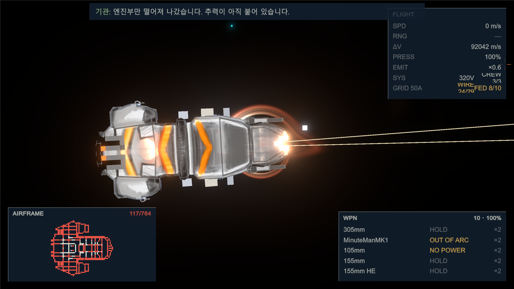
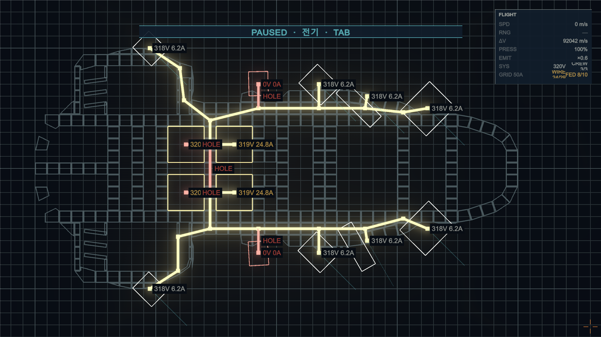
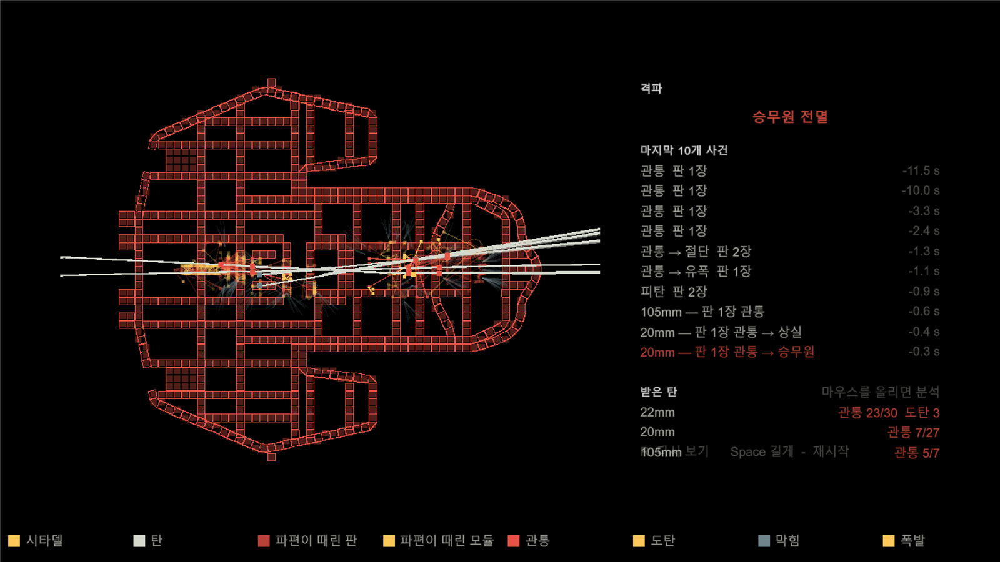
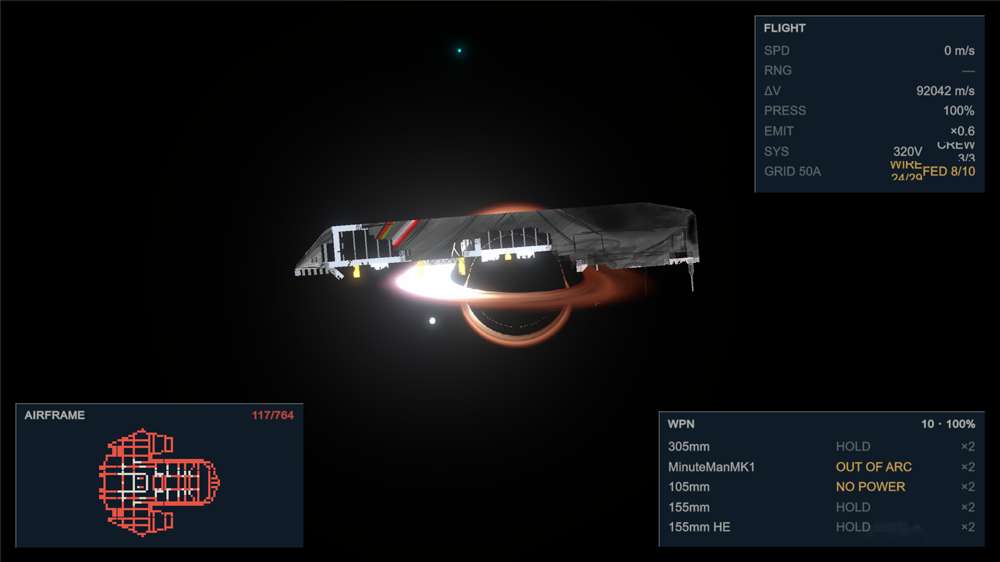

# SUPERRADIANCE

**쏜 곳이 실제로 부서지고, 그 결과를 안고 끝까지 간다.**

2D 탑뷰 함선 시뮬레이션 로그라이크. 우주 로그라이크 × War Thunder × Teardown.
Unity 6000.3, URP 2D. 2026-08-11에 첫 커밋, 이 문서는 그 뒤 39일째의 상태다.

> Ships are hundreds of 1 m armour plates, not an HP bar. Every hit is resolved by an
> RHA penetration formula through a 6×6 sub-cell channel inside the plate, and whatever
> breaks stays broken for the rest of the run. Ramming, hull severing, ammunition
> cook-off and "half a ship still fighting" are not scripted events - they emerge from a
> handful of base rules. This README is in Korean; the design doc is `Docs/GDD.md`.

---

| 정지 회로도 (Space · Tab 전기 층) | 격파 X-ray |
|---|---|
|  |  |

## 규칙 하나

특수한 결과를 스크립트로 가짜 구현하지 않는다. 기본 규칙을 만들고, 상황은 거기서 자연발생시킨다.

이 게임에서 아래 넷은 **전부 전용 코드가 없다.**

| 일어나는 일 | 실제로 도는 규칙 |
|---|---|
| 충각으로 적함 허리를 끊는다 | 충격 전도의 감쇠가 등방성이 아니다(충격축 0.80/m, 옆 0.30/m). 그 띠가 반대쪽 외판까지 닿아 판이 죽으면, 매 틱 도는 선체 연결성 BFS가 두 덩어리를 찾아 가른다 |
| 탄약고 유폭이 배를 두 동강 낸다 | 같은 전도 함수에 등방성(along == across)을 주면 띠가 원이 된다. "폭발" 시스템은 없다. 탄약고를 어디에 붙였는지가 곧 결과다 - 선수에 있으면 앞만 날아가고, 중앙 격벽 사이에 있으면 배가 갈린다. 분기문은 없다 |
| 엔진부만 떨어져 나가고 본체는 표류한다 | 모듈은 자기가 붙은 판의 자식이다. 판이 잔해로 떨어지면 엔진도 같이 간다. 배는 `StillAboard`로 매 틱 소속을 다시 확인하고, 100 m 뒤의 엔진으로는 가속하지 않는다 |
| 주포 하나만 남은 반파 함선이 계속 싸운다 | 전투 종료 조건은 술어 하나(`IsCombatEffective`)다. 포탑이 살아 있고 급전되고 사수가 있으면 전투는 안 끝난다 |

## 물밑에서 도는 것

화면에서는 판이 부서지는 것만 보인다. 그 밑에서 실제로 계산되는 것:

- **탄도** - 판마다 6×6 서브셀 격자. 탄은 DDA로 서브셀 채널을 지나고, 유효 RHA도 피해 분배도 채널 전체가 받는다. 경사판은 실물 폴리곤 비율(`_solid`)만큼만 막는다. 관통·도탄·비관통·파쇄 판정은 RNG 없는 순수 함수(`PenetrationManager`).
- **운동량** - 탄착이 배를 미는 것은 배율이 아니라 `탄 질량 × (입사 속도 - 이탈 속도)`를 명중점에 넣는 충격량이다. 관통한 탄은 덜 밀고, 튕긴 탄은 더 민다. 병진과 회전이 같은 식에서 나온다.
- **파단** - 방은 빈 칸을 4방향으로, 선체는 실물을 8방향으로 잇는 두 개의 BFS. 판 하나가 죽을 때마다 3×3 링 검사로 BFS를 생략할 수 있는지 먼저 본다.
- **후면 장갑** - 외판 뒤에 칸 단위 두 번째 층이 있고, 그 모양은 격자가 아니라 판 폴리곤의 합집합을 16배 해상도로 굽고 바깥에서 flood해서 얻는다. 뚫고도 안 들어오는 탄은 여기서 멈춘 것이다.
- **전력망** - 원자로 → 케이블(서브셀 래스터) → 포탑·엔진. 방사형 회로를 두 패스(뒤로 합성저항, 앞으로 전압강하)로 정확히 푼다. 탄이 케이블을 끊으면 그 뒤의 포탑은 선회 속도가 전압에 비례해 떨어진다.
- **방과 기압** - 밀폐된 주머니가 방이다. 안테나·마스트는 실물이지만 방을 만들지 않는다(`Vent`).
- **적열** - HP와 다른 정보다. HP는 "얼마나 상했나", 열은 "**언제** 상했나". 방금 찢어진 단면은 빨갛고 한참 전에 떨어진 잔해는 검다. 셰이더가 1을 넘는 색을 2D 라이트 곱셈 밖에서 더해 Bloom이 문다.
- **결정론** - RNG는 `(stableId, tick, ...)` 해시뿐. 같은 시드, 같은 입력이면 같은 파편이 같은 방향으로 튄다.

## 그것이 화면에 나오는 자리

시뮬레이션이 아는 것은 플레이어도 알 수 있어야 한다.

- 명중마다 판정 텍스트 - 관통 / 도탄 / 비관통 / 파쇄, 입사각과 유효 장갑 두께.
- 포탑이 안 쏘는 이유 - 장전 중 / 선회 중 / 아군 사선 / 사각 밖 / 사수 없음 / 전압 부족. 넷이 "안 쏜다" 하나로 뭉치지 않는다.
- 격파 X-ray - 죽는 순간 탄의 비행 경로와 판 단면을 재생한다. 되감기(R), 시타델 위치, "왜 뚫렸나" 조언 네 문장은 `acos(rha/pen)` 하나에서 파생된다.
- 정지 회로도(Space) - 건조 도면 위에 방·전선·기기·승무원을 겹쳐 그리고, 클릭한 것의 전압·전류·내구·위치가 패널에 나온다. Tab으로 전부/전기/기압 층을 돈다.
- HUD - 침로·속도·Δv·기압·전력(V·A)·승무원·탄약·판 수, 적함 CONTACT 격자.

## 데이터가 곧 게임

프리팹이 없다. 스프라이트 파일이 없다.

- 물건 한 종류 = `StreamingAssets/Defs/<종류>/<이름>.json` 하나. 어느 C# 클래스를 붙일지, 콜라이더가 얼마인지, 수치가 얼마인지 전부. 오타 난 키는 조용히 버려지지 않고 그 def가 안 실린다.
- 배 한 척 = `StreamingAssets/Ships/<이름>.json`. 판 배치 리스트 + 배 수치. 저작은 씬에서 하고 export로 뽑는다. 손상된 배는 배치가 적은 같은 파일이다 - 세이브가 곧 설계도.
- 그림은 콜라이더에서 런타임에 만든다. 판은 선체 그림 한 장 + 6×6 손상 마스크를 셰이더가 조합하고, 모듈은 def의 PNG 한 장.
- def는 서로를 이름으로만 안다(`"projectile": "Railgun Bullet"`). 그게 모딩이 열리는 지점이다.

## 숫자

| | |
|---|---|
| 첫 커밋 | 2026-08-11 |
| 커밋 | 221 |
| C# | 127 파일, 50,455줄 |
| 에디터 셀프테스트 | 26 (씬·플레이 모드 없이 도는 순수 함수 테스트) |
| def | 45종 (장갑·포·탄·모듈·효과) |
| 함선 | 26척 |
| 대본 | 40장 |

## 실행

Unity 6000.3.8f1. `Assets/Scenes/SampleScene.unity`를 열고 Play.

| 키 | |
|---|---|
| W A S D | 추진 |
| 마우스 | 기수와 포탑이 커서를 따라간다 · 정지 중 휠 줌, 끌어서 이동 |
| L-클릭 | 사격 |
| Shift | 부스터 |
| Space | 정지 / 회로도 · 대사 넘기기 |
| Tab | 정지 중 층 전환 (전부 / 전기 / 기압) |
| R | 격파 X-ray 되감기 |

탄도 수식을 건드렸으면 `Tools > Ballistics > Run Penetration Tests`.

## 문서

- [`CLAUDE.md`](CLAUDE.md) - **시뮬레이션 불변식.** 디버깅으로 알아낸 것들이라 코드만 봐서는 안 보인다. 건드리기 전에 읽는다.
- [`Docs/GDD.md`](Docs/GDD.md) - 게임 디자인 문서. 구현된 것 기준.
- [`STORY.md`](STORY.md) - 서사 단일 원본. 여기와 어긋나면 코드가 틀린 것이다.
- [`Docs/Electrical-Design.md`](Docs/Electrical-Design.md) - 전력망 설계 (전압·전류·차단기·승무원 직무).
- [`Docs/Economy-Design.md`](Docs/Economy-Design.md) - 급여·수리·구매.
- [`Assets/StreamingAssets/Dialogue/README.md`](Assets/StreamingAssets/Dialogue/README.md) - 대본 작성법.

## 만드는 방법

설계는 오너(고1)가 내고, 구현은 Claude와 같이 한다. 시뮬레이션 규칙 하나하나가 "이렇게 하면 이게 자연발생하나"를 확인한 결과이고, 그 확인에서 알아낸 것을 `CLAUDE.md` 불변식으로 적어 다음 작업이 같은 자리에서 안 틀리게 한다. 학습 목표는 자주 쓰는 알고리듬을 이 게임의 실제 자리에서 오너가 손으로 짓는 것이다 - 회차 규칙과 커리큘럼 표가 `CLAUDE.md`에 있다.
